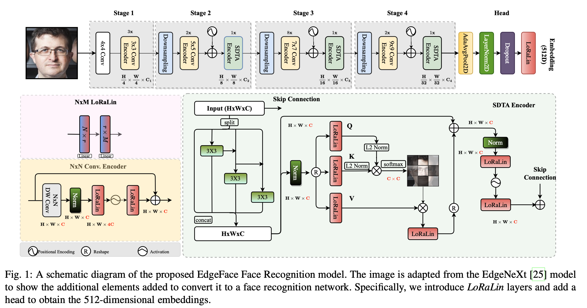

# FaceBoxes - EdgeFace: Face Recognition Pipeline for Edge Devices

[](https://paperswithcode.com/sota/lightweight-face-recognition-on-lfw?p=edgeface-efficient-face-recognition-model-for)
[](https://paperswithcode.com/sota/lightweight-face-recognition-on-calfw?p=edgeface-efficient-face-recognition-model-for)
[](https://paperswithcode.com/sota/lightweight-face-recognition-on-cplfw?p=edgeface-efficient-face-recognition-model-for)
[](https://paperswithcode.com/sota/lightweight-face-recognition-on-cfp-fp?p=edgeface-efficient-face-recognition-model-for)
[](https://paperswithcode.com/sota/lightweight-face-recognition-on-agedb-30?p=edgeface-efficient-face-recognition-model-for)	
[](https://paperswithcode.com/sota/lightweight-face-recognition-on-ijb-b?p=edgeface-efficient-face-recognition-model-for)	
[](https://paperswithcode.com/sota/lightweight-face-recognition-on-ijb-c?p=edgeface-efficient-face-recognition-model-for)	


This repository implements a comprehensive face recognition pipeline using the FaceBoxes model for face detection and a state-of-the-art face recognition Edgeface model. The pipeline is designed to be modular and efficient, making it suitable for various real-world applications on edge computing devices.
It contains the inference code and pretrained models to use [**EdgeFace: Efficient Face Recognition Model for Edge Devices**](https://ieeexplore.ieee.org/abstract/document/10388036/), 
which is the **winning entry** in *the compact track of ["EFaR 2023: Efficient Face Recognition Competition"](https://arxiv.org/abs/2308.04168) organised at the IEEE International Joint Conference on Biometrics (IJCB) 2023* and [**FaceBoxes: A CPU Real-time Face Detector with High Accuracy**](https://arxiv.org/abs/1708.05234) for the ultra high speed face detection on cpu devices.





## Installation
```sh
$ pip install -r requirements.txt
```

## Pre-trained models
- EdgeFace-s (gamma=0.5): available in [`checkpoints/edgeface_s_gamma_05.pt`](checkpoints/edgeface_s_gamma_05.pt)
- EdgeFace-xs (gamma=0.6): available in [`checkpoints/edgeface_xs_gamma_06.pt`](checkpoints/edgeface_xs_gamma_06.pt)
- FaceBoxes: available in [`weights/FaceBoxes.pth`](weights/FaceBoxes.pt)

## Performance
The performance of each EdgeFace models is reported in Table 2 of the [paper](https://arxiv.org/pdf/2307.01838v2.pdf):


Comparison of FaceBoxes with other edge efficient detection models is reported in the below table:


## Reference
The EdgeFace model have been used from the research work mentioned in the paper [published](https://ieeexplore.ieee.org/abstract/document/10388036/) in the IEEE Transactions on Biometrics, Behavior, and Identity Science (IEEE T-BIOM). The PDF version of the paper is available as [pre-print on arxiv](https://arxiv.org/pdf/2307.01838v2.pdf). The complete source code for reproducing all experiments in the paper (including training and evaluation) is also publicly available in the [official repository](https://gitlab.idiap.ch/bob/bob.paper.tbiom2023_edgeface).
